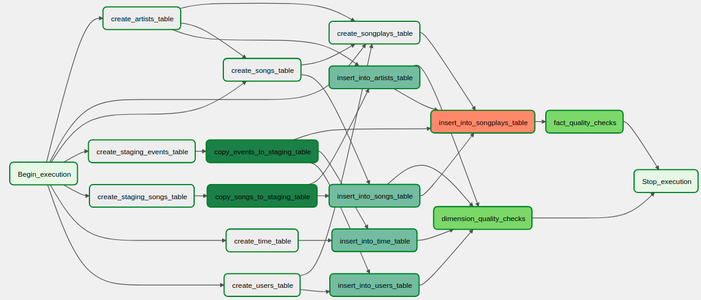

# Data Pipelines with Airflow
## Udacity Data Engineering Nanodegree - Data Pipelines with Airflow

### Project Context
* A music streaming company, Sparkify, has decided that it is time to introduce more automation and monitoring to their data warehouse ETL pipelines and come to the conclusion that the best tool to achieve this is Apache Airflow.
* They have also noted that the data quality plays a big part when analyses are executed on top the data warehouse and want to run tests against their datasets after the ETL steps have been executed to catch any discrepancies in the datasets.
* The source data resides in S3 and needs to be processed in Sparkify's data warehouse in Amazon Redshift. The source datasets consist of JSON logs that tell about user activity in the application and JSON metadata about the songs the users listen to.

### Data Modeling Solution
* The Data Models proposed, with Facs and Dimensions, are described in details in this repository: https://github.com/wesleyjr01/udacity_project_data_warehouse_redshift

### DAGs with Airflow
* To Orchestrate all the jobs necessary from creating the all the Staging, Facs and Dimension databases, to loading the data inside them and perform data qualities, tracking all of it's dependencies, we are using Airflow as a Job Orchestration Tool, and the final DAG proposed follows:   

* The DAG definition can be found in `dags/sparkify_redshift_etl.py`
* The Custom Operators defined can be found in `plugins/operators`. Additionally, all the SQL Queries necessary to create and insert data into the tables are defined in `plugins/helpers/sql_queries.py`

### Reference: Airflow Quickstart with Docker
* https://airflow.apache.org/docs/apache-airflow/stable/start/docker.html
